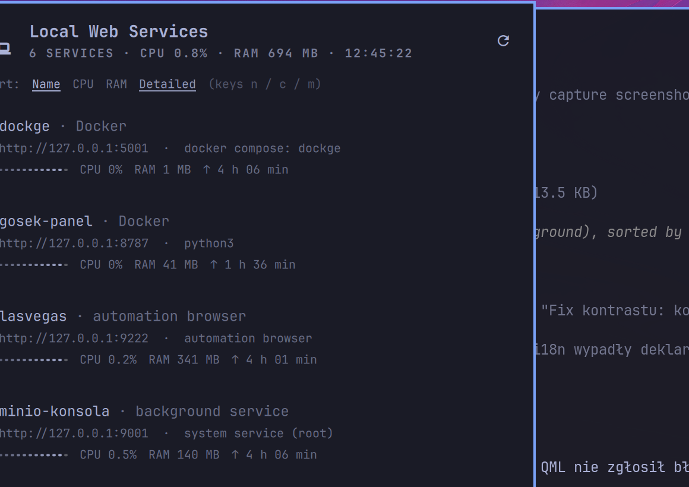

# Local Web Services — Omarchy bar widget

**pablo.uslugi** · Shows every local web service listening on your machine —
from Docker containers, user processes and system services — right in the
Omarchy bar. Click an entry to open it in your browser.



*(preview: compact rows, sorted by CPU; full view adds URL, technology detail
and a CPU sparkline)*

## Why

You run half a dozen small web UIs on your desktop — Docker containers, a
panel, a dev server — and remembering ports is a chore. This widget lists them
in plain language (**Docker**, **background service**, **venv**, **automation
browser**, …) with live RAM/CPU and uptime, and one click opens the right URL.

## Install

```bash
omarchy plugin add https://github.com/PNowakBG/omarchy-uslugi-www --enable
~/.config/omarchy/plugins/pablo.uslugi/install.sh   # expose the scanner in ~/.local/bin
```

Update: `omarchy plugin update pablo.uslugi` ·
Remove: `omarchy plugin remove pablo.uslugi` (then
`rm ~/.local/bin/uslugi-www-stan`).

## Usage

| action | how |
|---|---|
| open a service | click its row (opens `omarchy-launch-browser <url>`) |
| sort by name / CPU / RAM | buttons in the panel, or keys `n` / `c` / `m` |
| compact ↔ detailed view | link next to sort, or key `d` |
| refresh | key `r`, middle-click, or the ↻ button |

**Detailed view** shows URL, the exact technology (e.g. `docker compose:
dockge`, `systemd: gosek-panel.service (--user)`) and a 12-sample CPU
sparkline. **Compact view** fits every service on one line — no scrolling.
Sorting and the totals (`6 services · CPU 0.6% · RAM 695 MB`) are always
visible in the header.

## What it detects

The scanner (`bin/uslugi-www-stan`, python3 stdlib only) merges:

- **`docker ps`** — published container ports → **Docker** (with compose
  project name when present),
- **`ss -tlnp`** — listening sockets:
  - your own processes → **local process**, **Python venv**, **Node.js**,
    **Java**, **automation browser** (DevTools), …
  - **root/system sockets without a visible process** (MinIO, Sunshine…) are
    shown **only if you declare them in the map** (labelled *system service*),

plus cgroup-based detection of **Kubernetes**, **Podman**, **virtual
machines** (libvirt/QEMU), **LXC**, **Flatpak**, **Snap** and **AppImage**.
Well-known noise ports (DNS, CUPS, SSH, Sunshine, …) are always skipped.

## Friendly names & hiding: `~/.config/local-www.map`

```text
# port name            → friendly name (overrides the process name)
# port name !          → hide this port
# port name unit       → root service: systemd unit to read metrics from
# port name unit env   → override the environment label shown to humans
9000 minio-s3 minio.service
9001 minio-konsola minio.service
9222 lasvegas          # automation browser (DevTools, custom profile)
8787 gosek-panel Docker
```

Automation browsers (Chrome/Chromium with `--remote-debugging-port`) are named
after their `--user-data-dir` profile, so you never see a bare "chromium".

## Widget settings

| key | default | description |
|---|---|---|
| `refreshIntervalSec` | `15` | scan interval (min. 5) |
| `display` | `full` | `full` or `compact` |
| `language` | `auto` | `auto` (follows `LANG`), `pl` or `en` |

## Languages

Polish and English, chosen automatically from your system `LANG`; force one
with the `language` setting. Environment labels are translated in the QML
layer — the scanner emits neutral keys, and map overrides are always shown
verbatim.

## Requirements

Omarchy (or any Omarchy-shell setup) with `python3`, `ss` (iproute2) and
`omarchy-launch-browser`. `docker` is optional — only needed if you actually
run containers.

## Files

- `manifest.json` — plugin manifest (id `pablo.uslugi`, bar-widget),
- `Panel.qml` — bar widget + dropdown panel,
- `bin/uslugi-www-stan` — the scanner (python3, stdlib only),
- `install.sh` — idempotent symlink of the scanner into `~/.local/bin`,
- `local-www.map.example` — commented example of the port map.

## License

[MIT](LICENSE)
---

### Polski (skrót)

Widget paska Omarchy pokazujący **lokalne usługi WWW** (Docker, procesy,
usługi systemowe) z portami, RAM/CPU i uptime — klik otwiera usługę
w przeglądarce. Instalacja i skrót po polsku:

```bash
omarchy plugin add https://github.com/PNowakBG/omarchy-uslugi-www --enable
~/.config/omarchy/plugins/pablo.uslugi/install.sh
```

- sortowanie: Nazwa / CPU / RAM (klawisze `n` / `c` / `m`),
- widok zwięzły ↔ pełny (klawisz `d`),
- przyjazne nazwy i ukrywanie portów: `~/.config/local-www.map`
  (format: `port nazwa [unit] [środowisko]`, `!` ukrywa),
- język polski wchodzi automatycznie przy `LANG=pl_*`.
